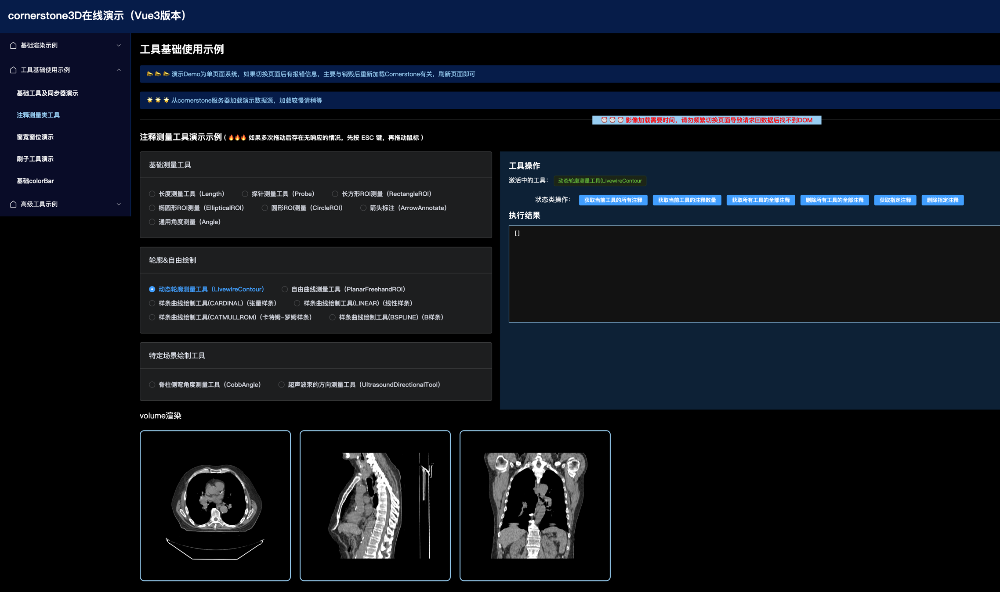
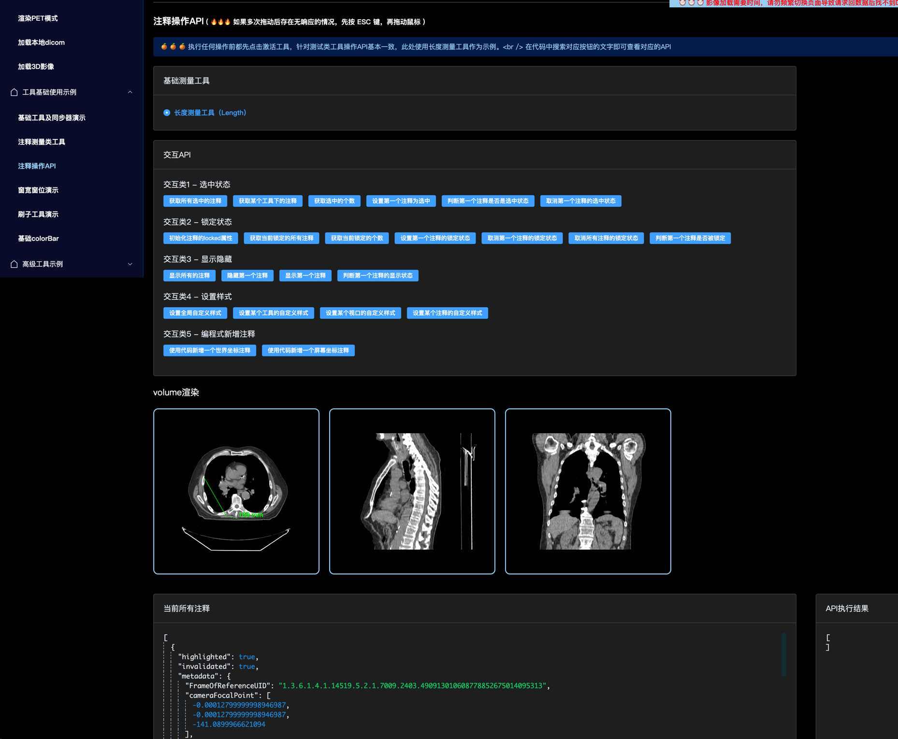

# Cornerstone 3D 演示案例（基于Vue3框架）
⛳️ 该仓库为从0开始上手 `Cornerstone3D` 的演示示例，从基础的影像渲染、工具运用，逐步延展至业务需求、自定义工具类等场景，直至源码解析环节。案例演示由易到难，循序渐进，对于刚刚开始接触Cornerstone的朋友极其友好。

🚀 目前Vue版本已由2.6升级至Vue3，打包工具为webpack，node版本20.17.0。项目中webpack的配置已解决部分新上手时问题，如果是使用vite打包可查看[vite构建](https://juejin.cn/post/7390577262292746291)

🎉  🎉  🎉  仓库将持续更新，欢迎大家Star，在使用过程中遇到任何相关问题或需要的功能示例欢迎随时issues或掘金博客中评论。

## 本地运行
1. clone到本地 `git clone https://github.com/jianyaoo/vue-cornerstone-demo.git`

2. 更新node版本为20版本以上 

3. 安装依赖 `yarn install`

4. 启动项目 `npm run serve`

## 已支持的功能
### 🎈 基础渲染示例
- [渲染栈影像](https://github.com/jianyaoo/vue-cornerstone-demo/blob/main/src/views/basicUsage/BaseStack.vue)
- [渲染Volume影像](https://github.com/jianyaoo/vue-cornerstone-demo/blob/main/src/views/basicUsage/BaseVolume.vue)
- [渲染nifti文件](https://github.com/jianyaoo/vue-cornerstone-demo/blob/main/src/views/basicUsage/BaseNiftyFile.vue)
- [渲染PET融合模式](https://github.com/jianyaoo/vue-cornerstone-demo/blob/main/src/views/basicUsage/BasicPET.vue)
- [加载本地dicom](https://github.com/jianyaoo/vue-cornerstone-demo/blob/main/src/views/basicUsage/LocalFile.vue)
- [渲染3D影像](https://github.com/jianyaoo/vue-cornerstone-demo/blob/main/src/views/basicUsage/Basic3DRender.vue)

### 📡 工具基础使用示例
- [基础工具使用](https://github.com/jianyaoo/vue-cornerstone-demo/blob/main/src/views/basicTools/BasicToolUse.vue)
- [窗宽窗位演示](https://github.com/jianyaoo/vue-cornerstone-demo/blob/main/src/views/basicTools/WindowLevel.vue)
- [注释工具使用](https://github.com/jianyaoo/vue-cornerstone-demo/blob/main/src/views/basicTools/AnnotationTool.vue)
- [注释工具操作API](https://github.com/jianyaoo/vue-cornerstone-demo/blob/main/src/views/basicTools/AnnotationOperator.vue)
- [刷子工具演示](https://github.com/jianyaoo/vue-cornerstone-demo/blob/main/src/views/basicTools/BasicSegmentation.vue)
- [基础colorBar](https://github.com/jianyaoo/vue-cornerstone-demo/blob/main/src/views/basicTools/ColorBar.vue)

### 🪜 高级工具示例
- [高级colorBar示例](https://github.com/jianyaoo/vue-cornerstone-demo/blob/main/src/views/advancedUsage/ReconColorBar.vue)

## 博客
### 🌾 图解系列
- [一文(10图)了解Cornerstone3D核心概念(万字总结附导图)](https://juejin.cn/post/7326432875955798027)
- [一文(N长图)了解Cornerstone3DTools常用工具(万字总结附导图)](https://juejin.cn/post/7330300019022495779)

### 🌿 基础功能系列
- [如何渲染一个基础的Dicom文件](https://juejin.cn/post/7322754558275878924)
- [如何渲染一个nifti格式的文件](https://juejin.cn/post/7324886896214605878)
- [如何渲染一个3D影像](https://juejin.cn/post/7406150677225685031)
- [使用Cornerstone加载本地的dicom文件并渲染](https://juejin.cn/post/7393189744329719846)
- [Cornerstone加载本地Dicom文件第二弹 - Blob篇](https://juejin.cn/post/7399530649999654946)
- [Cornerstone渲染CT+PET融合影像及相关应用场景](https://juejin.cn/post/7405250711283335206)

### 🍒 工具应用系列
- [Cornerstone3D Tools对影像进行交互(上篇)-基础交互工具及同步器](https://juejin.cn/post/7407644269995065384)

### 🌴 场景及原理解析系列
- [获取Dicom文件某点CT值的实践方案](https://juejin.cn/post/7320474963063259177)
- [一文了解Cornerstone3D中窗宽窗位的3种设置场景及原理](https://juejin.cn/post/7344881744245948453)

### 🍂 踩坑记录
- [Cornerstone3D导致浏览器崩溃的踩坑记录](https://juejin.cn/post/7390480675172728882)
- [记录vite项目中Cornerstone的兼容问题](https://juejin.cn/post/7390577262292746291)

## 项目截图
### 渲染栈影像

### 渲染volume影像

### 渲染PET融合模式

### 基础工具使用

### 注释工具使用

### 注释工具操作API

