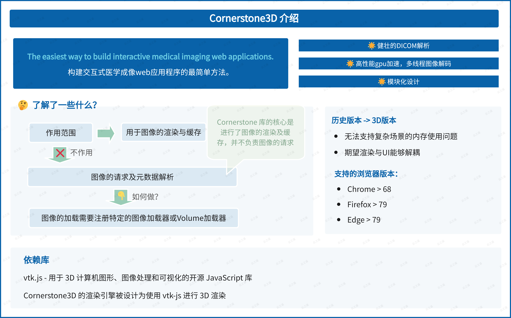

Cornerstone3D是一个专门为处理三维医学影像而设计的JavaScript库。

它是Cornerstone项目的一部分，旨在为医学影像社区提供高性能、可扩展且易于使用的开源Web工具，专注于提供交互式的3D医学图像浏览体验，适用于多种医学影像格式。

## 特性

- **健壮的DICOM解析**：能够处理和显示各种3D医学影像格式，如CT、MRI和PET扫描等，支持Dicom格式、NifTi格式的影像加载

- **高性能渲染：**使用WebGL进行图像渲染、使用多线程进行图像编码，优化了图像的加载和显示速度，从而提供了流畅的用户体验

- **模块化设计**：设计了灵活的架构，允许开发者扩展自己的工具和定制功能，以适应特定的医学影像应用需求。

## 版本对比

Cornerstone3D 和 Cornerstone 版本对比，主要在图像处理、渲染性能上进行了提升。2D版本无法更好的支持复杂场景的使用，例如多平面重建、Series融合等等。以下是从不同场景进行的对比：

### Cornerstone（2D版本）

- **图像处理：**专注于处理和展示二维医学影像数据

- **渲染性能：**针对2D图像优化，提供高效的加载和显示性能。

- **工具和功能**：包括基本的图像操作工具，如缩放、平移、旋转、亮度/对比度调节，以及医学影像中常用的注释和测量工具。

### Cornerstone3D（3D版本）

- **图像处理**：能够处理和展示三维医学影像数据，如从CT或MRI扫描得到的体积数据集。

- **渲染性能**：使用WebGL等技术进行3D渲染，优化了处理和显示大型体积数据集的能力。

- **工具和功能**：除了包含2D版本的基本功能外，还提供3D特有的功能，如多平面重建（MPR）、体积渲染、图像分割等等。

## 依赖项

### vtk.js

vtk.js是一个开源的javascript库，用于3D计算机图形，图像处理和可视化。Cornerstone3D的渲染引擎被设计为使用vtk.js进行3D渲染

### 浏览器支持

Cornerstone3D使用HTML5 canvas元素和WebGL 2.0 GPU渲染来渲染所有现代浏览器都支持的图像。但是并不是所有浏览器都支持volume streaming(使用SharedArrayBuffer创建共享内存)等高级功能。

- Chrome > 68

- Firefox > 79

- Edge > 79

### SharedArrayBuffer

需要重点关注 [SharedArrayBuffer](https://developer.mozilla.org/en-US/docs/Web/JavaScript/Reference/Global_Objects/SharedArrayBuffer#security_requirements) 问题，如果项目是部署在非[安全上下文](https://developer.mozilla.org/en-US/docs/Web/Security/Secure_Contexts)的环境中，SharedArrayBuffer 默认是不支持的，需要设置跨域隔离。

## 作用范围

原文：[https://www.cornerstonejs.org/docs/getting-started/scope](https://www.cornerstonejs.org/docs/getting-started/scope)

Cornerstone3D是一个Javascript库，它利用纯粹的网络标准实现医学图像的3D渲染。该库在可能的情况下采用WebGL进行GPU加速渲染。Cornerstone3DTools是Cornerstone3D的同级库，包含了多种操控和注释工具，用于与图像进行交互。

Cornerstone3D的范围 **并不包括** 处理图像/体积的加载和元数据解析，**只作用于图像渲染和缓存**。应该使用imageLoader.registerImageLoader和volumeLoader.registerVolumeLoader注册到Cornerstone3D来使用图像/体积的请求加载。

在Cornerstone3D中，发布了第一个volumeLoader，streaming-image-volume-loader，它能够逐个流式传输体积图像。

## 总结回顾

