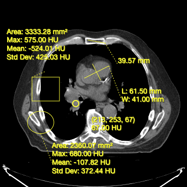
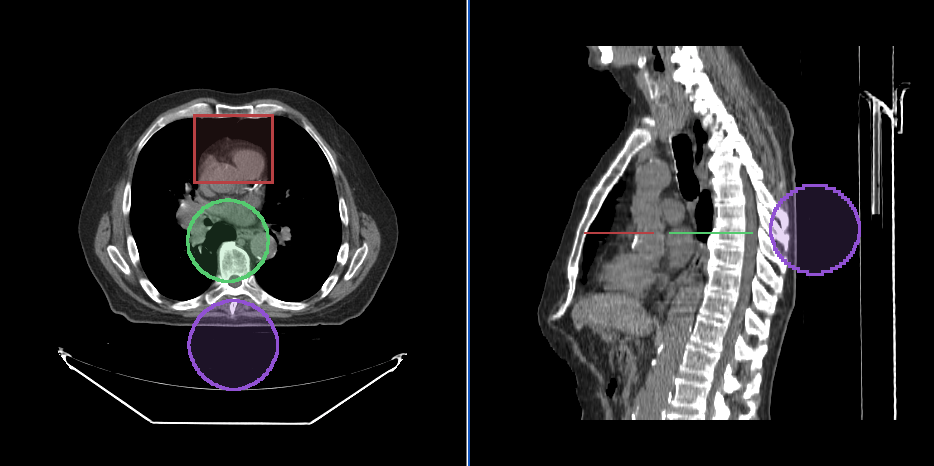

简单介绍一下在Cornerstone中什么是工具，工具是一个未实例化的类，它至少实现了`BaseTool`接口。

如果我们想要在我们的代码中使用一个工具，则必须实现以下两个步骤：

1. 使用Cornerstone的顶层addTool函数添加未实例化的工具

2. 将工具添加到工具组中

## 支持的工具类型

我们在使用工具时，主要会涉及到对图像的原始操作(缩放、平移等等)、注释操作(在图像的上层圈定一定的区域查看信息)、分割操作等等。

所以介绍的工具主要分为以下三大类：

- 操作类工具

- 注释类工具

- 分割类工具


### 操作类工具

Cornerstone3DTools提供了一组工具，可用于在视口中操作图像。主要包括

- 放大和缩小图像(ZoomTool)

- 平移图像(PanTool)

- 滚动图像的instance(StackScrollTool)

- 操作图像的windowLevel (WindowLevelTool)


### 注释类工具

Cornerstone3DTools提供了一套注释工具。可以用来创建和编辑注释

- 测量两点距离(Length Tool)

- 测量宽度和长度(Bidirectional Tool)

- 矩形面积的测量和统计(RectangleRoi Tool)

- 测量椭球体的体积和统计信息(EllipseRoi Tool)

- 获取体素的底层值(Probe Tool)




### 分割类工具

Cornerstone3D还提供了分割工具。这包括3D SegmentationDisplay和3D分割编辑工具，如画笔，矩形和圆形剪刀，以及3D球体工具。




## 工具的模式

我们注册的工具(在对应的toolGroup中)可以处于以下四种模式之一，每种模式都会影响工具对交互的响应方式。📢 **注意：在同一种绑定方式下有且仅有一种工具被激活，不会有两个工具被激活**

|模式|对应的交互效果|
|-|-|
|Active（激活模式）|1. Active模式下的工具将响应交互
2. 如果该工具是注释工具，则单击未覆盖现有注释的事件将创建新注释，覆盖现在注释将选中注释|
|Passive (default)（消极模式）|1. 如果工具是注释工具，如果它可以被选中，它可以被移动和重新定位。
2. 不响应交互|
|Enabled（可用模式）|1. 工具可以呈现，但不能进行交互响应|
|Disabled（禁用模式）|1. 工具既不渲染，也不会响应交互|

## 工具组

ToolGroup是Cornerstone3D中的一个新概念。

ToolGroup的目标是定义一种简单的方法，以每个视口方式定义工具的行为。 除此之外，绑定了同一个TooGroup的Viewport可以共享工具组相同的配置、模式及组内的工具。


### Viewport 和 ToolGroup 的关系

Viewport 和 ToolGroup 是一对一的关系，同一个ToolGroup可以绑定多个Viewport，但是一个Viewport只能绑定一个ToolGroup


### 创建及使用工具组

toolGroup由ToolGroupManager管理。ToolGroupManager用于创建、搜索和销毁工具组

**初始化工具组**

```JavaScript
import { ToolGroupManager } from '@cornerstonejs/tools';

const toolGroupId = 'ctToolGroup';
const ctToolGroup = ToolGroupManager.createToolGroup(toolGroupId);
```

**工具组添加工具**

```JavaScript
ctToolGroup.addTool(PanTool.toolName);
ctToolGroup.addTool(ZoomTool.toolName);
ctToolGroup.addTool(ProbeTool.toolName);
```

**工具组与视图进行绑定**

```JavaScript
ctToolGroup.addViewport(viewportId, renderingEngineId);
```

**激活一个工具**

```JavaScript
ctToolGroup.setToolActive(LengthTool.toolName, {
  bindings: [{ mouseButton: MouseBindings.Primary }],
});
ctToolGroup.setToolActive(PanTool.toolName, {
  bindings: [{ mouseButton: MouseBindings.Auxiliary }],
});
ctToolGroup.setToolActive(ZoomTool.toolName, {
  bindings: [{ mouseButton: MouseBindings.Secondary }],
});
ctToolGroup.setToolActive(StackScrollTool.toolName);
```


## 总结回顾


