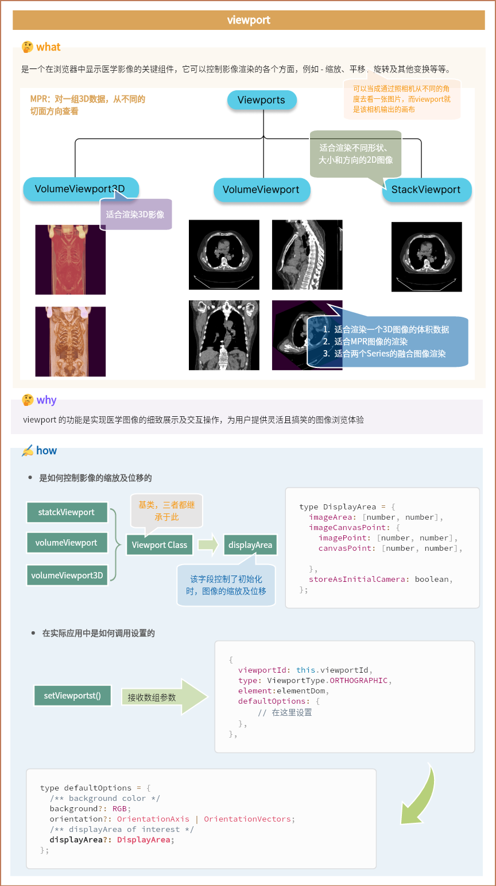

在 Cornerstone3D 中，viewport是由 HTML 元素创建的，我们需要提供用于创建viewport的元素。然后进行初始化绑定

## 分类

viewport主要分为 2D栈视图、Volume体视图、3D视图，根据不同的渲染需求进行选择。无论是哪一种视图类型，都是通过 RenderingEngine API 进行创建

### StackViewport

- 适用于呈现一堆图像，这些图像可能属于也可能不属于同一图像。

- Stack可以包含各种形状、大小和方向的2D图像

```JavaScript
const viewport = renderingEngine.getViewport('stackId');
await viewport.setStack(imageIds);
```

### VolumeViewport

- 适合于渲染被认为是一个3D图像的体积数据。

- 使用VolumeViewport可以通过设计实现多平面重组或重建(MPR)，可以从不同的方向进行体积可视化，而不会增加性能成本。

- 用于两个series之间的图像融合

### 3D Viewport

- 适用于实际的三维立体数据渲染。

- 有不同类型的预设，如骨，软组织，肺等。

## 初始化

所有的Viewport都继承自Viewport类，它提供了一个displayArea字段。该字段可用于以编程方式设置图像的初始缩放/平移。

默认情况下，视口将使dicom图像适合屏幕。displayArea字段支持以下配置内容：

```JavaScript
type DisplayArea = {
  imageArea: [number, number], // areaX, areaY
  imageCanvasPoint: {
    imagePoint: [number, number], // imageX, imageY
    canvasPoint: [number, number], // canvasX, canvasY
  },
  storeAsInitialCamera: boolean,
};
```


### 设置初始化时的缩放

在初始化时，如果想要设置图像为200%，则设置如下

```JavaScript
 imageArea: [0.5, 0.5],
```


### 设置初始化时的平移

在初始化时，如果想要左对齐图像，则设置如下

```JavaScript
imageCanvasPoint: {
  imagePoint: [0, 0.5], 
  canvasPoint: [0, 0.5], 
};
```

这意味着画布上的左(0)中间(0.5)点需要与图像上的左(0)中间(0.5)点对齐。数值基于完整图像的%大小。


## 如何在实际应用中更改

在创建视图时进行初始化

```JavaScript
renderingEngine.setViewports([{
    viewportId: 'ctAxial',
    type: ViewportType.ORTHOGRAPHIC,
    element: htmlElement1,
    defaultOptions: {
      orientation: Enums.OrientationAxis.AXIAL,
      displayArea:{
        // 需要更改的配置项
      }
    },
}]);
```

## 总结概述



