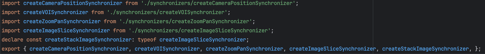

同步器（Synchronizers）可以使多个视图同步响应同一个工具的操作，例如我们在MPR视图下，同步操作三个视图的缩放程度、windowLevel等等

一个同步器必须需要以下几个部分才可以执行

- 一个监听事件（什么情况下触发同步）

- 一个回调函数（监听事件触发时需要执行什么操作）

- 一组源视图（原作用于哪些视图）

- 一组目标视图（要同步于哪些视图）


## 使用同步器

同步器的使用方式类似于工具组，先使用 SynchronizerManager 创建一个同步器，被创建的同步器含有addSource、addTarget、add（将视图作为source视图和target视图同步添加）等函数。

**特别值得注意的是：当绑定了同步器的视图被禁用时，同步器会自动在target列表和source列表中移除被禁用的视图，而无需手动操作。**


### 内置的同步器

可以在 @cornerstonejs/tools 抛出的 `synchronizers` 对象中查看内置的同步器，从以下图片可看到目前内置了5种同步器（实际是4种，`createStackImageSynchronizer` 和 `createImageSliceSynchronizer` 功能性一致，只是兼容性处理）



- **createCameraPositionSynchronizer**: 创建一个新的同步器，监听CAMERA_MODIFIED呈现事件并调用cameraSyncCallback。

- **createVOISynchronizer** :创建一个新的同步器，监听VOI_MODIFIED渲染事件并调用voiSyncCallback。

- **createZoomPanSynchronizer**：创建一个新的同步器，监听CAMERA_MODIFIED事件并调用zoomPanSyncCallback

- **createImageSliceSynchronizer**：创建一个新的同步器，监听STACK_NEW_IMAGE渲染事件并调用ImageSliceSyncCallback。


### 使用内置同步器

以同步更新缩放和位移位置为例，演示一下在我们的代码中如何使用内置同步器

**创建同步器**

```JavaScript
import {synchronizers, SynchronizerManager} from '@cornerstonejs/tools'
synchronizers.createZoomPanSynchronizer(’CAMERA_SYNCHRONIZER_ID‘);
```

**绑定视图**

```JavaScript
// 根据同步器ID获取到对应的同步器
const cameraSynchronizer = SynchronizerManager.getSynchronizer('CAMERA_SYNCHRONIZER_ID');

// 为同步器绑定视图，add表示将当前视图同步绑定到source列表和target列表中
cameraSynchronizer.add({
  renderingEngineId,
  viewportId,
});
```


### 自定义同步器

如果内置的同步器无法满足我们的需求，支持自定义一个同步器。如果我们想要自定义一个同步器主要需要实现以下一个核心点

```JavaScript
 import { Enums } from '@cornerstonejs/core';
import { SynchronizerManager } from '@cornerstonejs/tools';

const cameraPositionSynchronizer = SynchronizerManager.createSynchronizer(
  'synchronizerName', // 核心点1：同步器的ID
  Enums.Events.CAMERA_MODIFIED, // 核心点2：同步器监听的事件
  (
    synchronizerInstance,
    sourceViewport,
    targetViewport,
    cameraModifiedEvent
  ) => {
    // 核心点3：监听事件后触发的回调函数
  }
);
```


以下为内置的createCameraPositionSynchronizer同步器的实现

```JavaScript
export default function createCameraPositionSynchronizer(
  synchronizerName: string
): Synchronizer {
  const cameraPositionSynchronizer = createSynchronizer(
    synchronizerName,
    CAMERA_MODIFIED,
    cameraSyncCallback
  );

  return cameraPositionSynchronizer;
}
```


## 总结回顾


