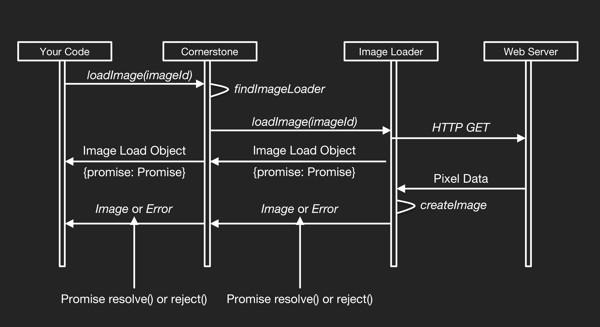
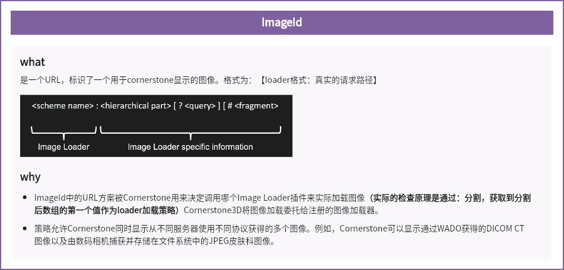
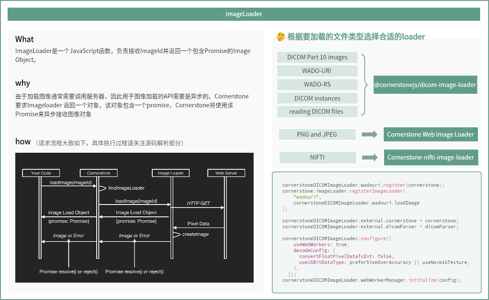

## ImageId

Cornerstone3D中的ImageId是一个用于识别单个图像以供Cornerstone显示的URL。该URL被Cornerstone用来确定调用哪个图像加载器插件来实际加载图像。

值得注意的是，Cornerstone3D将图像的加载工作委托给**已注册**的图像加载器。

这种策略允许Cornerstone同时显示从不同服务器通过不同协议获取的多个图像。


## Image Loader

ImageLoader是一个JavaScript函数，负责接收ImageId并返回一个图像对象。由于加载图像通常需要调用服务器，因此图像加载的API需要是异步的。Cornerstone要求Image Loaders返回一个包含Promise的对象，Cornerstone将使用这个Promise异步接收图像对象，或者在发生错误时接收一个错误信息

### 支持的Loader类型

- [Cornerstone WADO Image Loader](https://github.com/cornerstonejs/cornerstone3D/tree/main/packages/dicomImageLoader)：支持DICOM第10部分图像；支持WADO-URI和WADO-RS；支持多帧DICOM实例；支持从文件对象读取DICOM文件

- [Cornerstone Web Image Loader](https://github.com/cornerstonejs/cornerstoneWebImageLoader)： 支持 PNG and JPEG 文件

- [Cornerstone-nifti-image-loader](https://github.com/cornerstonejs/cornerstone-nifti-image-loader)：支持 NifTi格式文件

### 注册一个ImageLoader

使用registerImageLoader注册指定协议的加载器，以下示例表示：wadouri 协议的图像使用 cornerstoneDICOMImageLoader加载器加载

```JavaScript
cornerstone.imageLoader.registerImageLoader('wadouri', cornerstoneDICOMImageLoader.wadouri.loadImage);

cornerstoneDICOMImageLoader.wadouri.register(cornerstone);  
cornerstoneDICOMImageLoader.external.cornerstone = cornerstone;
cornerstoneDICOMImageLoader.external.dicomParser = dicomParser;

```

### @cornerstonejs/dicom-image-loader

为Cornerstone3D库提供了一个DICOM图像加载器。这是[cornerstoneDICOMImageLoader]的后继产品，支持在3D库中使用。主要提供了以下新增特性：

- Typescript支持（及类型定义） 

- 更佳的开发体验（例如，单一仓库、代码规范检查等） 

主要特点为：

- 实现了一个通过HTTP GET请求加载DICOM实例的Cornerstone图像加载器。

    -  可与WADO-URI服务器一起使用 

    - 可与Orthanc的文件终端一起使用 

    - 可与任何通过HTTP GET返回DICOM P10实例的服务器一起使用

-  实现了一个用于WADO-RS（DICOMWeb）的Cornerstone图像加载器 

- 支持许多流行的传输语法和光度解释

- 动态地利用WebAssembly（WASM）构建每个编解码器，显著提高图像解码性能，并使我们能够在需要时动态加载编解码器，从而减少构建时间和复杂性

- 用于在Web Workers中执行CPU密集型任务的框架 

    - 用于图像解码 

    - 用于CPU密集型任务（例如，图像处理）

### 图像加载流程

1. ImageLoader使用registerImageLoader API在Cornerstone中注册，以加载特定的ImageId URL方案

2. 应用程序使用loadImage API来加载堆栈中的图像，或者使用createAndCacheVolume API来加载体积数据。

3. Cornerstone将加载图像的请求委托给已注册相应ImageId URL方案的ImageLoader。

4. ImageLoader将返回一个包含Promise的图像加载对象，

5. 一旦获取到像素数据，它将用相应的图像对象解析这个Promise。获取像素数据可能需要通过XMLHttpRequest调用远程服务器，对像素数据进行解压（例如，来自JPEG 2000的数据），并将像素数据转换成Cornerstone能够理解的格式（例如，RGB与YBR颜色）。通过解析Promise返回的图像对象，随后将通过renderingEngine API显示。




## 总结回顾

### ImageId



### ImageLoader



