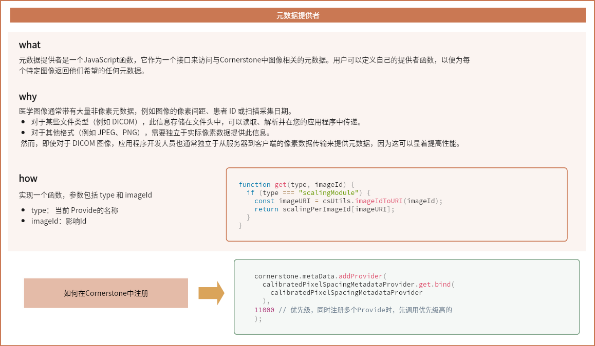

医学影像通常附带大量非像素级的元数据，例如图像的像素间距、患者 ID 或扫描获取日期等等。对于某些文件类型（例如 DICOM），这些信息存储在文件头中，可以被读取、解析并在应用程序中传递。而对于其他类型（例如 JPEG、PNG），这些信息需要独立于实际像素数据提供。

元数据提供器是一个 JavaScript 函数，作为访问 Cornerstone 中与图像相关元数据的接口。用户也可以定义自己的提供器函数，以返回他们希望的每个特定图像的任何元数据。

## 自定义元数据提供器

提供器需要实现一个get函数，该函数接收一个 type 和 ImageId， 返回当前ImageId中业务需要的数据

```JavaScript
function addInstance(imageId, scalingMetaData) {
  const imageURI = csUtils.imageIdToURI(imageId);
  scalingPerImageId[imageURI] = scalingMetaData;
}

function get(type, imageId) {
  if (type === 'scalingModule') {
    const imageURI = csUtils.imageIdToURI(imageId);
    return scalingPerImageId[imageURI];
  }
}

export default { addInstance, get };
```

## 在项目中注册使用

通过addProvider函数，在CornerStone中添加提供器

```JavaScript
  cornerstone.metaData.addProvider(
    ptScalingMetaDataProvider.get.bind(ptScalingMetaDataProvider),
    10000,
  );
```

## 优先级

由于可以注册多个元数据提供器，因此在添加提供器时，可以为其定义一个优先级数字。

当需要请求元数据时，Cornerstone 将按照提供器的优先级顺序请求图像的元数据（如果提供器对于图像 ID 返回未定义，则 Cornerstone 将转向下一个提供器）。例如，如果 provider1 注册时优先级为 10，而 provider2 注册时优先级为 100，则首先向 provider2 请求图像 ID 的元数据。上面的示例中我们定义了一个优先级为10000的provider

## 总结概述



