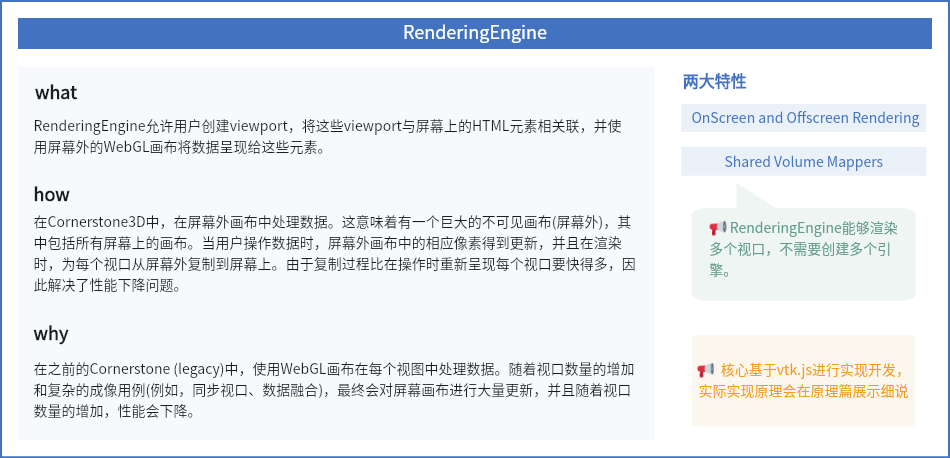

RenderingEngine允许用户创建Viewports，将这些viewport与屏幕上的 HTML 元素关联，并使用WebGL 画布将数据渲染到这些元素上。

值得注意的是，RenderingEngine 能够渲染多个viewport，而无需创建多个引擎。

在Cornerstone3D 中，从零开始构建了 RenderingEngine，并使用 vtk.js 作为渲染的支撑，vtk.js 是一个 3D 渲染库，能够利用 WebGL 进行 GPU 加速渲染。


## 特性

### 1. 渲染优化

在 Cornerstone（2D）中，每个viewport都使用 WebGL 画布处理数据。随着viewport数量的增加，尤其在复杂的影像应用场景中（例如，同步视窗），因为会导致屏幕上画布的大量更新，以及随着视窗数量增加而性能下降。

在 Cornerstone3D 中，在屏幕外处理数据。这意味着我们有一个大型的不可见画布（离屏），它内部包含了所有屏幕上的画布。当用户操纵数据时，离屏画布中相应的像素会被更新，在渲染时，将数据从离屏画布复制到每个视窗的屏幕上画布。由于复制过程比重新渲染每个视窗上的操纵更快，因此解决了性能下降的问题。

### 2. 共享Volume Mapper

vtk.js 提供了用于渲染的标准渲染功能。此外，在 Cornerstone3D 中，引入了共享体积映射器（Shared Volume Mappers），以便在任何可能需要的视窗中重用数据，而无需复制数据。


## 使用

- 初始化一个renderingEngine

```JavaScript
import { RenderingEngine } from '@cornerstonejs/core';

const renderingEngineId = 'myEngine';
const renderingEngine = new RenderingEngine(renderingEngineId);
```

- 创建viewport并绑定视图

```JavaScript
const viewportInput = [
  // CT Volume Viewport - Axial
  {
    viewportId: 'ctAxial',
    type: ViewportType.ORTHOGRAPHIC,
    element: htmlElement1,
    defaultOptions: {
      orientation: Enums.OrientationAxis.AXIAL,
    },
  },
  // CT Volume Viewport - Sagittal
  {
    viewportId: 'ctSagittal',
    type: ViewportType.ORTHOGRAPHIC,
    element: htmlElement2,
    defaultOptions: {
      orientation: Enums.OrientationAxis.SAGITTAL,
    },
  },
  // CT Axial Stack Viewport
  {
    viewportId: 'ctStack',
    type: ViewportType.STACK,
    element: htmlElement3,
    defaultOptions: {
      orientation: Enums.OrientationAxis.AXIAL,
    },
  },
];

renderingEngine.setViewports(viewportInput);
```

- 渲染视图

```JavaScript
renderingEngine.renderViewports(['ctAxial','ctSagittal','ctStack']);
```


## 总结概述




