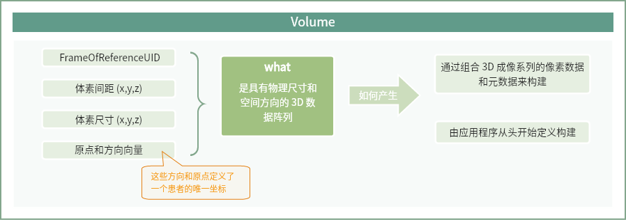
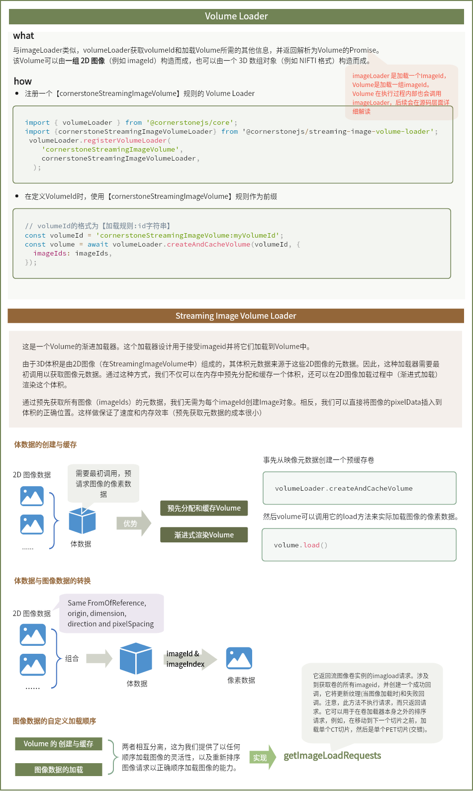

## Volume

Volume是一个具有空间物理大小和方向的3D**数据阵列**。

它可以通过组合3D成像系列的**像素数据**和**元数据**来构建，或者可以由应用程序从头定义。一个Volume拥有FrameOfReferenceUID、体素间距（x, y, z）、体素尺寸（x, y, z）、原点和方向向量，这些特征唯一地定义了它相对于患者坐标系统的坐标系统


### ImageVolume

在Cornerstone3D中，使用ImageVolume基类来表示3D图像体积。所有的Volume都是从这个类派生的。例如StreamingImageVolume，它被用来表示一个图像被流式传输的Volume。

所以所有的Volume都实现了以下这个接口：

```JavaScript
interface IImageVolume {
  /** 【缓存中Volume的唯一标识符】unique identifier of the volume in the cache */
  readonly volumeId: string
  /** volume dimensions */
  dimensions: Point3
  /** volume direction */
  direction: Float32Array
  /** volume metadata */
  metadata: Metadata
  /** volume origin - set to the imagePositionPatient of the last image in the volume */
  origin: Point3
  /** volume scalar data */
  scalarData: any
  /** volume scaling metadata */
  scaling?: {
    PET?: {
      SUVlbmFactor?: number
      SUVbsaFactor?: number
      suvbwToSuvlbm?: number
      suvbwToSuvbsa?: number
    }
  }
  /** volume size in bytes */
  sizeInBytes?: number
  /** volume spacing */
  spacing: Point3
  /** number of voxels in the volume */
  numVoxels: number
  /** volume image data as vtkImageData */
  imageData?: vtkImageData
  /** openGL texture for the volume */
  vtkOpenGLTexture: any
  /** loading status object for the volume containing loaded/loading statuses */
  loadStatus?: Record<string, any>
  /** imageIds of the volume (if it is built of separate imageIds) */
  imageIds?: Array<string>
  /** volume referencedVolumeId (if it is derived from another volume) */
  referencedVolumeId?: string // if volume is derived from another volume
  /** method to convert the volume data in the volume cache, to separate images in the image cache */
  convertToCornerstoneImage?: (
    imageId: string,
    imageIdIndex: number
  ) => IImageLoadObject
}
```

## Volume Loader

与ImageLoader类似，VolumeLoader接收一个Volume ID和加载Volume所需的其他信息，并返回一个解析为体积的Promise。

这个Volume可以由一组2D图像（例如，imageIds）构建，也可以由一个3D数组对象（如NIFTI格式）构建。我们添加了cornerstoneStreamingImageVolumeLoader库来支持将2D图像（imageIds）流式传输成3D体积。


### 注册一个Volume Loader

使用registerVolumeLoader来定义一个Volume Loader

```JavaScript
import {
  cornerstoneStreamingImageVolumeLoader,
  cornerstoneStreamingDynamicImageVolumeLoader,
} from '@cornerstonejs/streaming-image-volume-loader';

 // 注册体积加载器 => 当 CornerstoneJS 需要加载一个类型为 'cornerstoneStreamingImageVolume' 的体积数据时，它将会使用这个加载器。
  volumeLoader.registerVolumeLoader(
  'cornerstoneStreamingImageVolume',
  cornerstoneStreamingImageVolumeLoader,
);
```


## @cornerstonejs/streaming-image-volume-loader

### 从图片中创建Volume

由于在StreamingImageVolume中3D Volume是由2D图像组成的，它的体积元数据来源于2D图像的元数据，所以这个loader需要在初始时调用来获取图像元数据。这样做不仅可以在内存中预分配和缓存Volume，还可以在加载2D图像时渲染Volume(渐进式加载)

通过预先从所有图像(imageId)中获取元数据，不需要为每个imageId创建Image对象，将图像的pixelData直接插入到正确位置的volume中即可，这样保证了速度和内存效率。

### Volume与Image之间的转换

StreamingImageVolume基于一系列获取的图像(2D)加载Volume，Volume可以实现将其3D像素数据转换为2D图像的功能，而无需通过网络重新请求它们。

同样的，如果一组imageid具有Volume的属性(相同的FromOfReference, origin, dimension, direction和pixelSpacing)，那么Cornerstone3D可以从一组imageid创建一个Volume。

### 使用streaming-image-volume-loader

```JavaScript
const imageIds = ['wadors:imageId1', 'wadors:imageId2'];

const ctVolumeId = 'cornerstoneStreamingImageVolume:CT_VOLUME';

const ctVolume = await volumeLoader.createAndCacheVolume(ctVolumeId, {
  imageIds: ctImageIds,
});

await ctVolume.load();


```

### 自定义加载顺序

由于Volume的创建和缓存(createAndCacheVolume)与图像数据(load)的加载是分离的。所以支持以任何顺序加载图像，以及重新排序图像请求以正确顺序加载图像的能力。


### 大致的加载流程

1. 根据一组imageIds，计算Volume的元数据，如间距、原点、方向等。

2. 实例化一个新的StreamingImageVolume

3. StreamingImageVolume实现了加载方法（.load）

    4. 通过使用imageLoadPoolManager来实现加载请求

    5. 每个加载的帧（imageId）被放置在3D体积中的正确切片位置 

    6. 返回一个体积加载对象，该对象包含一个解析为体积的promise。


## 总结回顾

### Volume



### VolumeLoader



